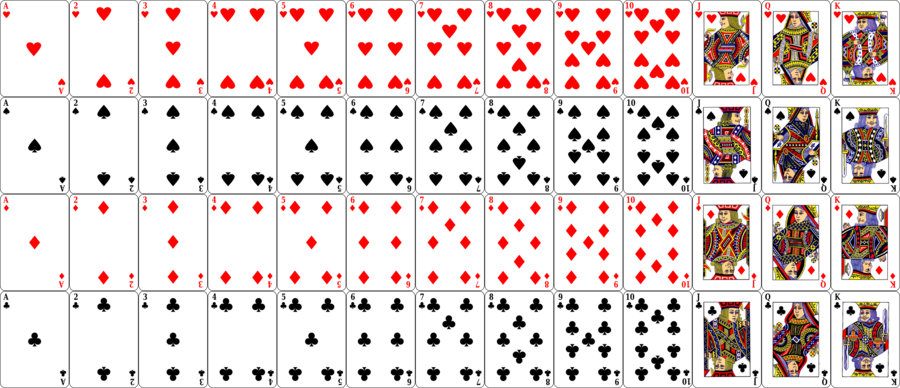

# TrickGame



## About The Project

General playground for a tricktaking card game with bids.

## Getting Started

### Prerequisites

### Usage

1. Define the rules wanted in the Makefile changing the line
`CXXFLAGS += -DRULES_XXX`, XXX in {BASIC, belote}
2. Define the global constant for the game in 'card.h' (highly dependent on the rules see at the beginning of 'XXX.cpp')
3. Setup the strategies wanted for each player and the wanted behavior of a game (how to deal cards, number of games, how to show results) in 'main.cpp'
4. run ```sh
make```

## Code

### Architecture
**main**: initiates game+players and simulates a game

**play**:  general functions to organize the playing of a game

**player**: define the functionalities of the Player class, with his knowledge and his strategy

**bidstrat/**: folder of different bidding strategies for a *player*

**trickstrat/**: folder of different tricktaking strategies for a player

**rules**: functions that directly depends on the rules of the game chosen (rules.cpp: functions that could be defined independently of the rules/rules/xxx.cpp: functions dependent)

**game**: class representing the state of a game when played, with simple primitives

**card**: basic utils functions with the manipulation of card type

### Notes

- The number of cards used has to be under 64
- Careful if suits are not bit adjacent
- Binary output of the game: win/loose
- Each trick every player plays
- AOS requires only two teams
- game over when N_ROUNDS are played
- With alpha-beta, if number of teams > 2, algo doesn't find all solutions
- ab: for equivalence, suits need to be connex (bit vector)

### Printing

Several levels of printing are allowed. One level includes every inferior level
- 0: prints nothing
- 1: prints only the score obtained
- 2: prints game as a spectator
- 3: prints game as an omniscient spectator
- 4: prints every attribute of the players and the game
- 5: prints also the main actions of the trickstrat
- 6: prints details of trickstrat level 1 (basic actions)
- 7: prints details of trickstrat level 2 (should not overflow)
- 8: prints details of trickstrat level 3 (could overflow)

### Debug
- profile: CXXFLAGS += 'pg' and ```make run``` and ```gprof bin/exec > perf.txt```
- mem leaks: CXXFLAGS += 'g' and ```valgrind --leak-check=full ./bin/exec```
